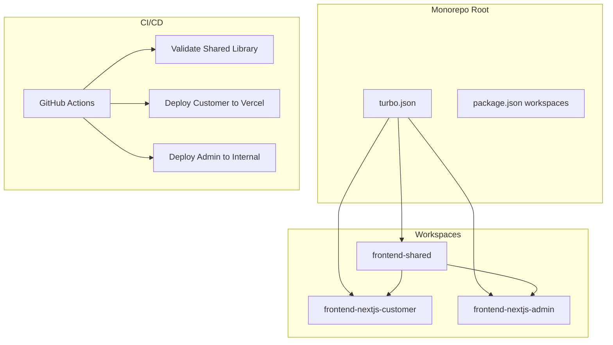

---
{}

> **⚠️ DEPRECATED (November 2025):**
> **This SPEC is DEPRECATED** - Turborepo and Next.js stack removed. CI/CD covered by SPEC-016.
> **Current Direction:** FastAPI handles both frontend rendering (templating) and backend APIs. All CI/CD orchestration is under SPEC-016.
> **See:** `specs/016-cicd-pipeline-architecture/spec.md` for current CI/CD architecture.
---


## 2) Solution

Use **Turborepo** for monorepo with:
- Shared dependency management (npm workspaces)
- Remote caching (Turbo cache)
- Parallel builds and tests
- Separate GitHub Actions workflows per app

---

## 3) Architecture



---

## 4) Implementation

**Root `package.json`:**
```json
{
  "name": "ninaivalaigal-monorepo",
  "private": true,
  "workspaces": [
    "frontend-shared",
    "frontend-nextjs-customer",
    "frontend-nextjs-admin"
  ],
  "scripts": {
    "build": "turbo run build",
    "dev": "turbo run dev --parallel",
    "test": "turbo run test",
    "lint": "turbo run lint"
  },
  "devDependencies": {
    "turbo": "^1.11.0"
  }
}
```

**`turbo.json`:**
See implementation stub with pipeline definitions

---

## 5) Success Criteria

- [ ] Turborepo configured with remote caching
- [ ] Build time < 2 minutes (with cache)
- [ ] Tests run in parallel
- [ ] GitHub Actions deploy customer app on push
- [ ] GitHub Actions deploy admin app on push
- [ ] Shared library changes trigger dependent builds

---

## 6) CI/CD Workflows

1. `shared-build-validate.yml` - Test shared library
2. `frontend-customer-deploy.yml` - Deploy to Vercel
3. `frontend-admin-deploy.yml` - Deploy to internal server

---

## 7) Monitoring

- Turbo cache hit rate (target > 80%)
- Build duration (track via GitHub Actions)
- Test execution time

---

## 8. Implementation Status

**Status:** ⚠️ **DEPRECATED** - Superseded by SPEC-016

**Deprecation Date:** November 2025

### Deprecation Rationale

**Original Purpose (Now Obsolete):**
- Turborepo orchestration for Next.js frontend apps
- Workspace structure: `frontend-shared`, `frontend-nextjs-customer`, `frontend-nextjs-admin`
- Tight coupling with SPEC-121/122/123 (all deprecated)

**New Reality:**
- **Frontend strategy dropped**: No active Next.js layer
- **Unified FastAPI**: Handles both frontend rendering (templating/UI) and backend APIs
- **CI/CD handled entirely under SPEC-016**, which already:
  - Manages multi-service builds (nv-api, nv-redis, nv-db, rust memory provider, etc.)
  - Has 28 validated workflows
  - Provides caching, parallelization, lint/test/build stages
  - Works with Apple Container CLI + GitHub Actions instead of Turborepo

**Conclusion:**
The purpose of SPEC-124 (Turborepo orchestration) has been fully absorbed into SPEC-016 and is functionally redundant.

**Replaced By:**
- **SPEC-016**: CI/CD Pipeline Architecture (Complete)
  - All CI/CD, caching, and workflow automation covered there
  - Historical note: SPEC-124 (Turborepo) deprecated after FastAPI migration, November 2025

---

**Status**: ⚠️ **DEPRECATED** - Superseded by SPEC-016 (CI/CD Pipeline Architecture)
**Deprecation Date:** November 2025
