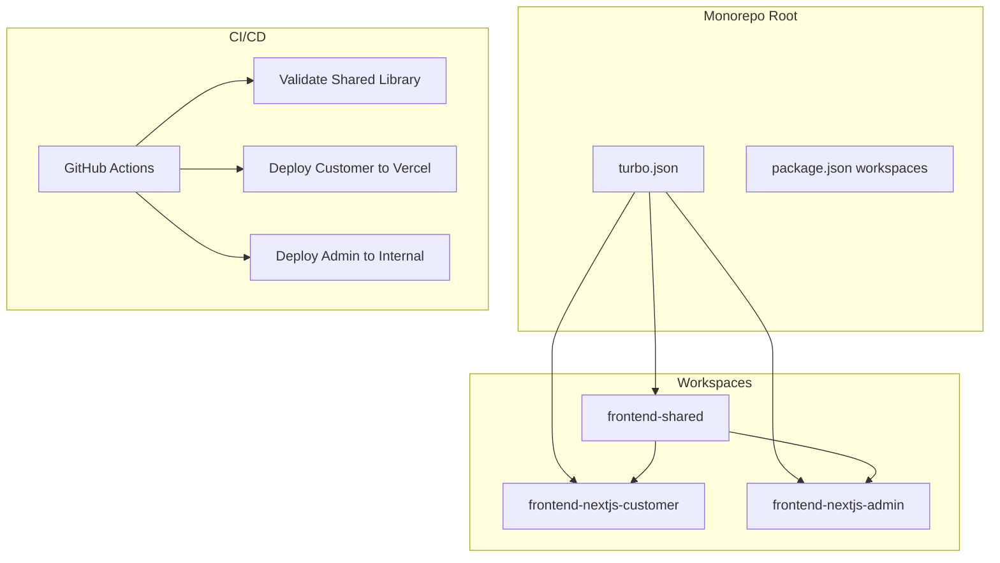

---
{}
---


## 2) Solution

Use **Turborepo** for monorepo with:
- Shared dependency management (npm workspaces)
- Remote caching (Turbo cache)
- Parallel builds and tests
- Separate GitHub Actions workflows per app

---

## 3) Architecture



---

## 4) Implementation

**Root `package.json`:**
```json
{
  "name": "ninaivalaigal-monorepo",
  "private": true,
  "workspaces": [
    "frontend-shared",
    "frontend-nextjs-customer",
    "frontend-nextjs-admin"
  ],
  "scripts": {
    "build": "turbo run build",
    "dev": "turbo run dev --parallel",
    "test": "turbo run test",
    "lint": "turbo run lint"
  },
  "devDependencies": {
    "turbo": "^1.11.0"
  }
}
```

**`turbo.json`:**
See implementation stub with pipeline definitions

---

## 5) Success Criteria

- [ ] Turborepo configured with remote caching
- [ ] Build time < 2 minutes (with cache)
- [ ] Tests run in parallel
- [ ] GitHub Actions deploy customer app on push
- [ ] GitHub Actions deploy admin app on push
- [ ] Shared library changes trigger dependent builds

---

## 6) CI/CD Workflows

1. `shared-build-validate.yml` - Test shared library
2. `frontend-customer-deploy.yml` - Deploy to Vercel
3. `frontend-admin-deploy.yml` - Deploy to internal server

---

## 7) Monitoring

- Turbo cache hit rate (target > 80%)
- Build duration (track via GitHub Actions)
- Test execution time
