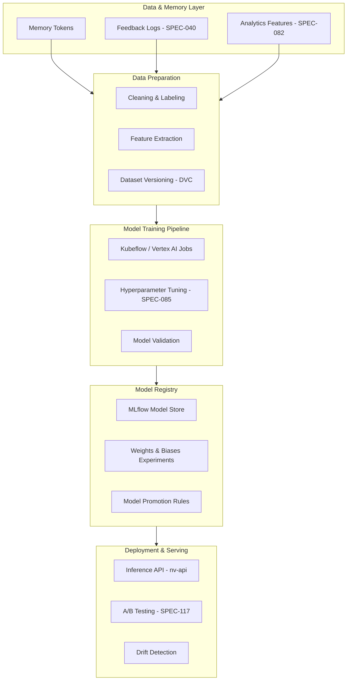

---
{}
---


## 2. Objectives

| Goal | Description |
|------|--------------|
| **Unified Training Pipeline** | Reproducible training via Kubeflow / Vertex AI / MLflow |
| **Model Fine-Tuning** | Domain-adaptive fine-tuning on internal datasets |
| **Experiment Tracking** | MLflow + Weights & Biases integration |
| **Continuous Retraining** | Triggered by SPEC-040 feedback loops |
| **Governance & Compliance** | Integrate lineage, license, and audit tracking |

---

## 3. System Architecture



---

## 4. Functional Scope

### 4.1 Training Infrastructure
- **GPU/TPU Orchestration**: Kubernetes GPU nodes with auto-scaling
- **Hyperparameter Tuning**: Optuna / Ray Tune integration
- **Distributed Training**: Multi-GPU via PyTorch DDP or Horovod
- **Spot Instance Support**: Cost-optimized training on preemptible VMs

### 4.2 Model Families

| Model | Function | Upstream SPEC | Training Data Source |
|--------|-----------|----------------|----------------------|
| Memory Relevance Scorer | Ranking & scoring | SPEC-031 | User feedback + click data |
| Memory Similarity Embedder | Embedding optimization | SPEC-041 | Memory-to-memory links |
| Behavior Predictor | User action modeling | SPEC-082 | Session analytics |
| Context Understanding | Context injection refinement | SPEC-040 | AI feedback loops |

### 4.3 MLOps Capabilities

**Data Versioning:**
- DVC (Data Version Control) for dataset snapshots
- Automated lineage tracking from raw data → trained model

**Experiment Tracking:**
- MLflow: Metrics, parameters, artifacts
- Weights & Biases: Real-time training visualization
- Integration with SPEC-082 analytics dashboard

**Model Promotion:**
- Automated validation gate (accuracy > threshold)
- Staging → Production promotion workflow
- Rollback capability with one-command revert

**Performance Monitoring:**
- Continuous drift detection (SPEC-040 feedback)
- Scheduled validation tests on hold-out sets
- Alert triggers for accuracy degradation

### 4.4 Compliance & Governance

**License Scanning:**
- Automated dependency license checks (GPL detection)
- Model card generation with training metadata

**Audit Trail:**
- Who trained the model (staff_id)
- When (timestamp)
- Why (trigger reason: scheduled / feedback-driven)
- What data (dataset version hash)

**Dual Approval:**
- Staff approval required for production promotion
- Logged in `staff_activity_log` (SPEC-085)

---

## 5. Integration Points

| SPEC | Description | Integration Type |
|-------|-------------|------------------|
| SPEC-031 | Memory Relevance Ranking | Provides labeled relevance data |
| SPEC-040 | Feedback Loop System | Feedback signals for retraining triggers |
| SPEC-041 | Related Memory Suggestions | Embedding and graph feature input |
| SPEC-082 | Analytics Dashboard | Metrics visualization + model performance tracking |
| SPEC-085 | AutoML Integration | Hyperparameter optimization automation |
| SPEC-117 | Feature Flags | A/B testing for model deployments |

---

## 6. Data Pipeline

### 6.1 Data Collection
```python
# Pseudocode: Collect training data from SPEC-040 feedback
from ninaivalaigal.ml import DataCollector

collector = DataCollector()
feedback_data = collector.fetch_feedback_logs(
    start_date="2025-01-01",
    min_confidence=0.7  # Only high-quality feedback
)
memory_data = collector.fetch_memory_tokens(
    include_embeddings=True
)
```

### 6.2 Data Preparation
```python
# Feature engineering
from ninaivalaigal.ml import FeatureExtractor

extractor = FeatureExtractor()
features = extractor.extract(
    feedback_data=feedback_data,
    memory_data=memory_data,
    feature_set="relevance_v2"
)

# DVC versioning
import dvc.api
dvc.api.save_data("datasets/relevance_v2.parquet", features)
```

### 6.3 Model Training
```python
# Kubeflow pipeline
from kfp import dsl

@dsl.pipeline(name="Memory Relevance Training")
def training_pipeline(
    dataset_version: str,
    model_type: str = "xgboost",
    max_trials: int = 50
):
    prep_op = dsl.ContainerOp(
        name="Data Prep",
        image="nv-ml-prep:latest",
        arguments=["--dataset", dataset_version]
    )

    train_op = dsl.ContainerOp(
        name="Model Training",
        image="nv-ml-train:latest",
        arguments=[
            "--model", model_type,
            "--trials", max_trials,
            "--gpu", "1"
        ]
    ).after(prep_op)

    eval_op = dsl.ContainerOp(
        name="Model Validation",
        image="nv-ml-eval:latest"
    ).after(train_op)
```

---

## 7. Implementation Plan

| Phase | Timeline | Deliverable | Success Criteria |
|-------|-----------|-------------|------------------|
| **Phase 3** | Q1 2025 | Complete SPEC-082, 085 foundations | Analytics dashboard + AutoML ready |
| **Phase 4A** | Q2 2025 | MLOps infrastructure setup | Kubeflow + MLflow operational |
| **Phase 4B** | Q3 2025 | Pipeline prototype & first models | Memory relevance model in staging |
| **Phase 4C** | Q4 2025 | Production rollout + monitoring | Models serving in production |
| **Phase 5** | 2026 | Federated learning + advanced AI | Multi-tenant model training |

---

## 8. Risks & Mitigations

| Risk | Impact | Mitigation | Owner |
|------|--------|------------|-------|
| High GPU cost | Budget overrun | Use spot instances + auto-scaling | Platform Ops |
| Data bias | Poor model accuracy | Add fairness metrics + diverse datasets | AI Core Team |
| GPL license risk | Legal compliance | Automated license scanning in CI/CD | Security Team |
| Model drift | Accuracy degradation | Scheduled validation + alerting | AI Core Team |
| Training failures | Pipeline downtime | Retry logic + monitoring | Platform Ops |

---

## 9. Success Metrics

### 9.1 Performance Metrics

| Metric | Baseline | Target | Measurement |
|---------|----------|---------|-------------|
| Memory relevance improvement | Current scoring | ≥15% increase | A/B test (SPEC-117) |
| Retraining latency | Manual (days) | &lt;6 hours | Pipeline execution time |
| Model accuracy (validation) | N/A | ≥85% | Hold-out test set |
| Rollback safety | Manual intervention | 100% automated | Incident count |
| Compliance pass rate | N/A | 100% | License scan pass rate |

### 9.2 Operational Metrics

| Metric | Target |
|---------|---------|
| Pipeline uptime | ≥99.5% |
| Training job success rate | ≥95% |
| GPU utilization | 70-85% |
| Cost per model training | &lt;$50 |

---

## 10. Deployment Architecture

### 10.1 Training Environment
```
Kubernetes Cluster (GPU Nodes)
├── Namespace: ml-training
│   ├── Kubeflow Pipelines
│   │   ├── Pipeline Controller
│   │   ├── Experiment Tracking (MLflow)
│   │   └── GPU-enabled Pods
│   ├── Data Services
│   │   ├── MinIO (artifact storage)
│   │   ├── PostgreSQL (metadata)
│   │   └── DVC Remote (S3/GCS)
│   └── Monitoring
│       ├── Prometheus (metrics)
│       └── Grafana (dashboards)
```

### 10.2 Model Serving
```
Production API (nv-api)
├── Model Registry (MLflow)
│   ├── Staging Models
│   └── Production Models
├── Inference Endpoints
│   ├── /ml/relevance/predict
│   ├── /ml/similarity/embed
│   └── /ml/behavior/forecast
└── A/B Testing (SPEC-117)
    ├── Model A (baseline)
    └── Model B (candidate)
```

---

## 11. Configuration Examples

### 11.1 Training Config
```yaml
# config/relevance_training.yaml
model:
  type: xgboost
  version: 1.7.0

hyperparameters:
  max_depth: [3, 5, 7]
  learning_rate: [0.01, 0.05, 0.1]
  n_estimators: [100, 200, 500]

resources:
  gpu: 1
  memory: 16Gi
  cpu: 4

validation:
  test_size: 0.2
  cv_folds: 5
  min_accuracy: 0.85
```

### 11.2 Deployment Config
```yaml
# config/model_serving.yaml
model:
  name: memory-relevance-scorer
  version: v2.1.0
  registry: mlflow://models/relevance-scorer

serving:
  replicas: 3
  max_batch_size: 32
  timeout_ms: 200

monitoring:
  drift_detection: true
  drift_threshold: 0.15
  alert_channel: "#ml-ops"
```

---

## 12. Testing Strategy

### 12.1 Unit Tests
- Test data preprocessing functions
- Test feature extraction logic
- Test model loading/inference

### 12.2 Integration Tests
- End-to-end pipeline execution
- MLflow artifact logging
- Model promotion workflow

### 12.3 Model Validation
- Accuracy on hold-out test set
- Performance regression tests
- Fairness metrics (bias detection)

---

## 13. Documentation Requirements

- [ ] Training pipeline architecture diagram
- [ ] Model card template (dataset, metrics, limitations)
- [ ] Runbook: Trigger manual retraining
- [ ] Runbook: Rollback model to previous version
- [ ] API documentation for inference endpoints

---

## 14. Next Steps

### Immediate (Q1 2025)
1. Complete SPEC-082 (Analytics Dashboard) - **In Progress**
2. Complete SPEC-085 (AutoML Integration) - **Planned**
3. Set up Kubeflow on Kubernetes cluster
4. Deploy MLflow model registry

### Short-term (Q2 2025)
1. Build data collection pipeline from SPEC-040 feedback
2. Create first training pipeline (Memory Relevance)
3. Implement DVC for dataset versioning
4. Set up GPU node pools in Kubernetes

### Long-term (Q3-Q4 2025)
1. Deploy all 4 model families to production
2. Implement continuous retraining triggers
3. Add federated learning capabilities
4. Integrate with SPEC-117 feature flags for A/B testing

---

**Version:** 1.0 (October 2025)
**Last Updated:** October 12, 2025
**Status:** ✅ **SPEC Complete - Ready for Implementation**

---

## Appendix A: Model Card Template

```markdown
# Model Card: Memory Relevance Scorer v2.1.0

## Model Details
- **Model Type:** XGBoost Classifier
- **Version:** 2.1.0
- **Training Date:** 2025-10-12
- **Owner:** AI Core Team

## Intended Use
- **Primary Use:** Rank memory tokens by relevance to user query
- **Out-of-Scope:** Not for medical/legal decision-making

## Training Data
- **Dataset:** Relevance v2 (DVC hash: abc123...)
- **Size:** 1.2M labeled examples
- **Time Range:** 2024-01 to 2025-09
- **Label Source:** User feedback (SPEC-040)

## Performance
- **Validation Accuracy:** 87.3%
- **Test Accuracy:** 86.1%
- **Precision:** 85.2%
- **Recall:** 88.7%

## Limitations
- May underperform on new domains not in training data
- Requires minimum 5 tokens for ranking

## Ethical Considerations
- Trained on opt-in user feedback only
- No PII in training data
- Bias mitigation: Diverse user sampling

## License
- **Code:** MIT
- **Model:** Proprietary (Medhasys LLC)
```

---

## Appendix B: Related SPECs

- **SPEC-031**: Memory Relevance Ranking (upstream data)
- **SPEC-040**: Feedback Loop System (training signals)
- **SPEC-041**: Related Memory Suggestions (graph features)
- **SPEC-082**: Analytics Dashboard (metrics visualization)
- **SPEC-085**: Staff Management (dual approval workflow)
- **SPEC-117**: Feature Flags (A/B testing)
