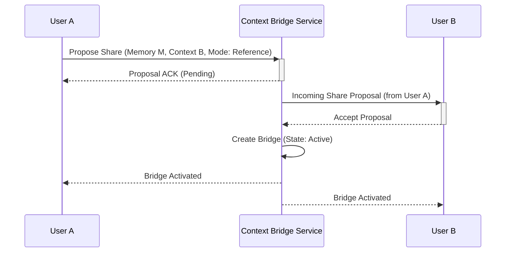

---
depends_on:
- SPEC-050
- SPEC-049
- SPEC-043
id: SPEC-127
owner: developer-b
phase: AI
sidebar_position: 127
start_date: 2025-10-01
status: Complete
tags:
- Memory
- Federation
- GraphOps
title: Context Bridge & Memory Federation System
updated: 2025-10-13
---


# SPEC-127: Context Bridge & Memory Federation System

**Status**: 🆕 Active Development  
**Phase**: Phase 3  
**Priority**: High  
**Created**: October 13, 2025  
**Owner**: To be assigned

---

## 🎯 Objective

Create a **unified inter-context memory sharing system** that enables secure, auditable memory federation across teams, organizations, and sub-projects **without duplication**. This SPEC consolidates and extends SPEC-050, SPEC-049, and SPEC-101 into a comprehensive context bridge architecture.

---

## 🔄 Consolidation Context

### **Existing SPECs Being Unified**:

| SPEC | Title | Status | What It Provides |
|------|-------|--------|------------------|
| **SPEC-050** | Cross-Org Memory Sharing | Draft | Org-to-org bridge, visibility scopes |
| **SPEC-049** | Memory Sharing Collaboration | Draft | User/team sharing, role-based access |
| **SPEC-101** | Memory Federation (Redis/GraphOps) | Complete | Distributed sync, federated queries |

### **New Capabilities Added**:
- ✨ **Reference vs Clone modes** (live link vs isolated copy)
- ✨ **Security & trust scoring system** (0-100 dynamic scoring)
- ✨ **Detailed GraphOps integration** architecture
- ✨ **Unified API surface** (single entry point)
- ✨ **Cross-context graph linking** (federated queries)

---

## 🎭 Use Cases

### **1. Cross-Team Collaboration**
```
Team A (Engineering) ⟷ Team B (Product)
├─ Engineering shares API specs (Reference Mode)
├─ Product references without duplication
└─ Live updates propagate automatically
```

### **2. Organization Federation**
```
Org A (Partner) ⟷ Org B (Main Company)
├─ Partner shares market intelligence (Clone Mode)
├─ Trust Score: 85/100 (High)
├─ Security: Isolated copy, no live sync
└─ Audit: Full trail of access
```

### **3. Sub-Project Communication**
```
Project Alpha ⟷ Project Beta
├─ Alpha shares ML training data (Hybrid Mode)
├─ Beta gets initial clone + sync triggers
├─ Trust Score: 100/100 (Internal)
└─ Graph: Linked via DERIVES_FROM edge
```

---

## 🏗️ Architecture Overview

### Bridge Lifecycle Flow



### Federated Query Path

```mermaid
graph TD
    subgraph User Context
        A[User Query]
    end
    subgraph System
        B{Federated Query Router}
        C[GraphOps Query Engine]
        D[Trust Score Service]
    end
    subgraph Data Stores
        E[Local Memory]
        F[Bridged Memory (Context B)]
        G[Bridged Memory (Context C)]
    end

    A --> B;
    B -- Route to Local & Bridged Contexts --> C;
    C -- Query Local --> E;
    C -- Query Bridge for B --> F;
    C -- Query Bridge for C --> G;
    B -- Check Trust Scores --> D;
    D -- Scores --> B;
    C -- Aggregated Results --> A;
```

```
┌─────────────────────────────────────────────────────────────┐
│                    Context Bridge Layer                      │
├─────────────────────────────────────────────────────────────┤
│                                                               │
│  ┌──────────────┐    ┌──────────────┐    ┌──────────────┐  │
│  │   Context A   │◄──►│ Bridge Core  │◄──►│   Context B   │  │
│  │  (Team/Org)   │    │              │    │  (Team/Org)   │  │
│  └──────────────┘    └──────────────┘    └──────────────┘  │
│         │                    │                    │          │
│  ┌──────▼──────┐      ┌─────▼─────┐      ┌──────▼──────┐  │
│  │   Memory    │      │   Trust    │      │   Memory    │  │
│  │   Store     │      │  Scoring   │      │   Store     │  │
│  └─────────────┘      └───────────┘      └─────────────┘  │
│         │                    │                    │          │
│  ┌──────▼────────────────────▼────────────────────▼──────┐ │
│  │          GraphOps Federation Layer (Apache AGE)       │ │
│  └───────────────────────────────────────────────────────┘ │
└─────────────────────────────────────────────────────────────┘
```

---

## 🔑 Core Components

### **1. Cross-Context Graph Linking**
See: [`graph-linking.md`](./graph-linking.md)
- Graph edge types (REFERENCES, DERIVES_FROM, SHARES_WITH)
- Context boundaries and trust zones
- GraphOps federation queries

### **2. Reference vs Clone Modes**
See: [`modes.md`](./modes.md)
- **Reference Mode**: Live link to original (no duplication)
- **Clone Mode**: Deep copy (isolated)
- **Hybrid Mode**: Clone with sync triggers

### **3. Security & Trust Scoring**
See: [`trust-scoring.md`](./trust-scoring.md)
- Dynamic trust score calculation (0-100)
- Trust-based access control
- Automatic trust adjustment

### **4. API Endpoints**
See: [`api-contracts.md`](./api-contracts.md)
- POST `/context-bridge/share`
- GET `/context-bridge/trust-score`
- GET `/context-bridge/graph-links`
- POST `/context-bridge/federated-query`

### **5. GraphOps Integration**
See: [`graphops-integration.md`](./graphops-integration.md)
- Federated graph queries
- Performance optimization
- Query caching strategies

---

## 📊 Database Schema

See: [`database-schema.md`](./database-schema.md)

**New Tables**:
- `context_bridges` - Bridge metadata and configuration
- `trust_scores` - Trust score cache and history
- `bridge_access_history` - Audit trail
- `sync_policies` - Hybrid mode sync configuration

---

## 🔒 Security Considerations

### **Trust Zones**:
- **Zone 0**: Same user (100% trust)
- **Zone 1**: Same team (90-100% trust)
- **Zone 2**: Same organization (70-90% trust)
- **Zone 3**: Partner organizations (50-80% trust)
- **Zone 4**: External services (0-60% trust)

### **Access Control**:
- Minimum trust score required per action
- Reference mode requires ≥70 trust
- Clone mode requires ≥50 trust
- Full sync requires ≥90 trust

### **Audit Requirements**:
- Every access logged with trust score
- Bridge creation/revocation audited
- Trust score changes tracked
- Compliance with data regulations

---

## 🚀 Implementation Plan

### **Phase 1: Foundation** (2 weeks)
- [ ] Database schema implementation
- [ ] Basic bridge creation (reference mode only)
- [ ] Trust score calculator (basic algorithm)
- [ ] Audit logging infrastructure

### **Phase 2: Modes** (2 weeks)
- [ ] Clone mode implementation
- [ ] Hybrid mode implementation
- [ ] Mode switching capabilities
- [ ] Sync trigger system

### **Phase 3: GraphOps** (2 weeks)
- [ ] Graph edge creation
- [ ] Federated query engine
- [ ] Performance optimization
- [ ] Query caching

### **Phase 4: Trust System** (1 week)
- [ ] Advanced trust scoring
- [ ] Dynamic trust adjustment
- [ ] Trust-based ACL enforcement
- [ ] Trust score API

### **Phase 5: API & Testing** (1 week)
- [ ] Complete API implementation
- [ ] Comprehensive testing
- [ ] Documentation
- [ ] Performance benchmarks

**Total Estimate**: 8 weeks

---

## 📈 Success Criteria

### **Functional**:
- ✅ Zero memory duplication for reference mode
- ✅ <100ms cross-context query performance
- ✅ Complete audit trail for all access
- ✅ Reference/Clone mode switching works

### **Security**:
- ✅ Trust scores calculated accurately
- ✅ Trust-based ACL enforced
- ✅ All access logged and auditable
- ✅ Compliance requirements met

### **Performance**:
- ✅ Federated queries <200ms (p95)
- ✅ Trust score calculation <50ms
- ✅ Support 1000+ concurrent bridges
- ✅ GraphOps queries optimized

---

## 🔗 Related SPECs

**Note on SPEC-043:** This SPEC assumes the existence of a robust ACL system as defined in SPEC-043. The integration points with SPEC-043 will need to be revisited and potentially updated once that SPEC is fully defined and implemented.

- **SPEC-043**: Memory ACL System (foundation)
- **SPEC-050**: Cross-Org Memory Sharing (consolidated)
- **SPEC-049**: Memory Sharing Collaboration (consolidated)
- **SPEC-101**: Memory Federation (consolidated)
- **SPEC-061**: Property Graph Intelligence (GraphOps)

---

## 📚 Additional Documentation

1. **[Graph Linking](./graph-linking.md)** - Graph edge types and queries
2. **[Modes Comparison](./modes.md)** - Reference vs Clone vs Hybrid
3. **[Trust Scoring](./trust-scoring.md)** - Trust algorithm and ACL
4. **[API Contracts](./api-contracts.md)** - Complete API specification
5. **[GraphOps Integration](./graphops-integration.md)** - Federation queries
6. **[Database Schema](./database-schema.md)** - Schema and migrations
7. **[Implementation Guide](./implementation-guide.md)** - Step-by-step guide

---

## 🎯 Key Benefits

1. **Zero Duplication**: Reference mode eliminates redundant storage
2. **Security First**: Trust-based access control with dynamic scoring
3. **Flexible Modes**: Choose right mode for each use case
4. **Auditable**: Complete audit trail for compliance
5. **Performant**: GraphOps federation with caching
6. **Scalable**: Supports thousands of concurrent bridges
7. **Unified**: Single system for all inter-context sharing

---

**Status**: Ready for implementation  
**Next Steps**: Assign to Developer B for detailed specification writing

