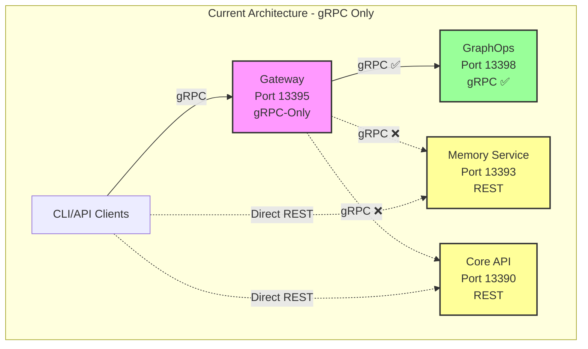
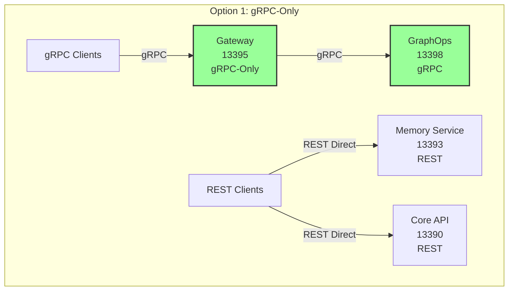
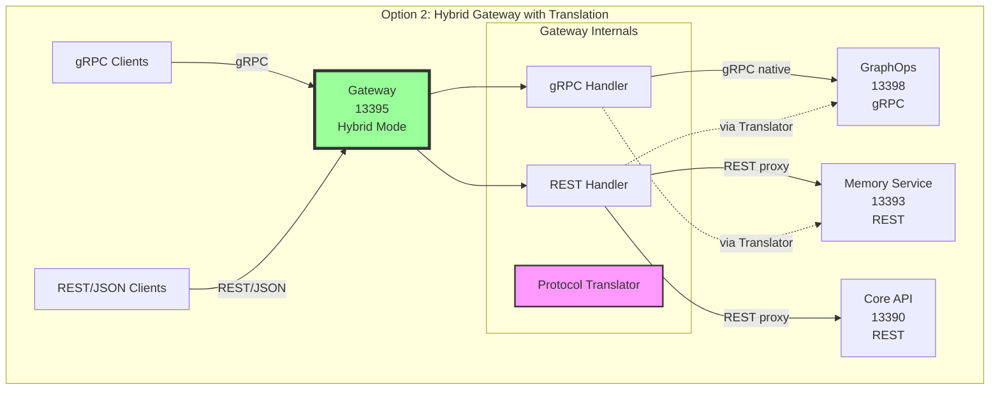
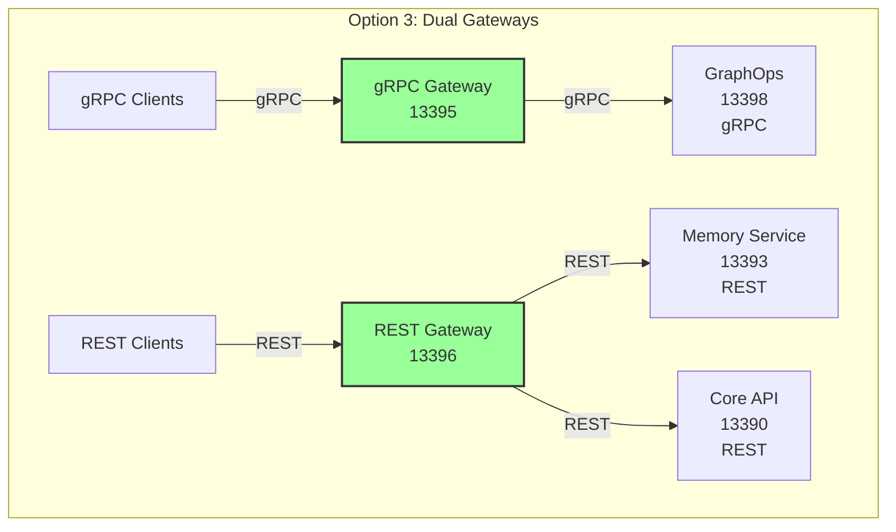
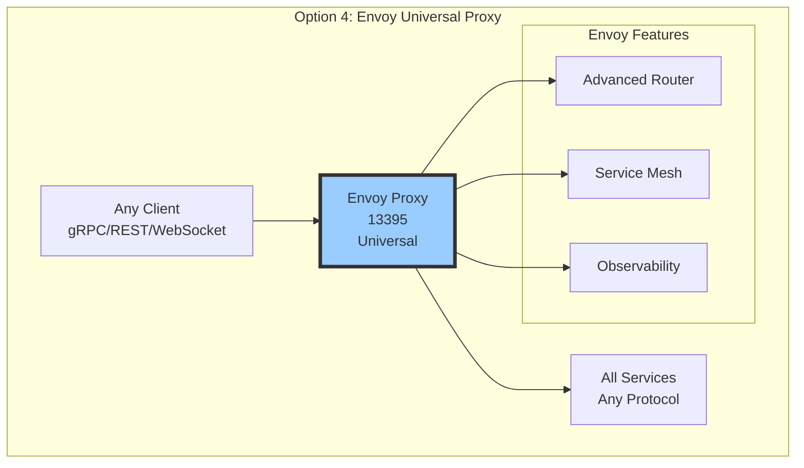
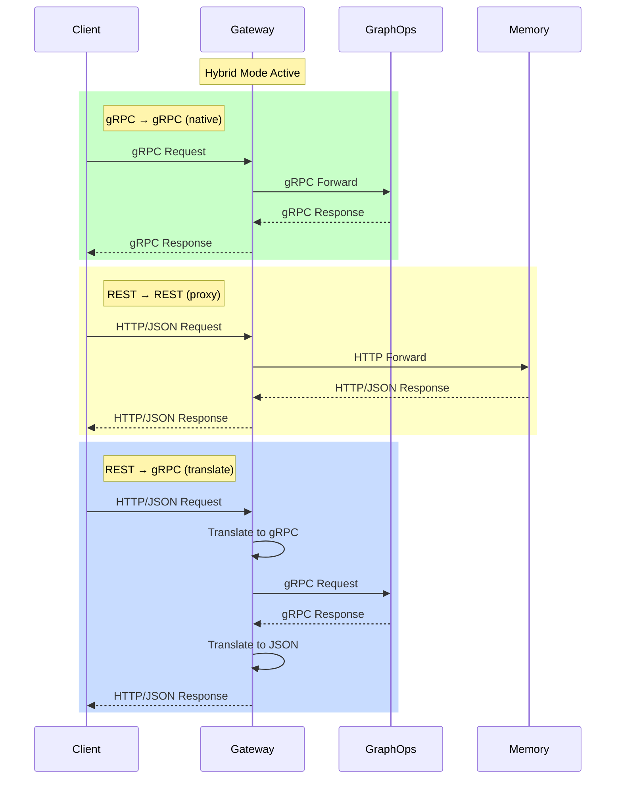
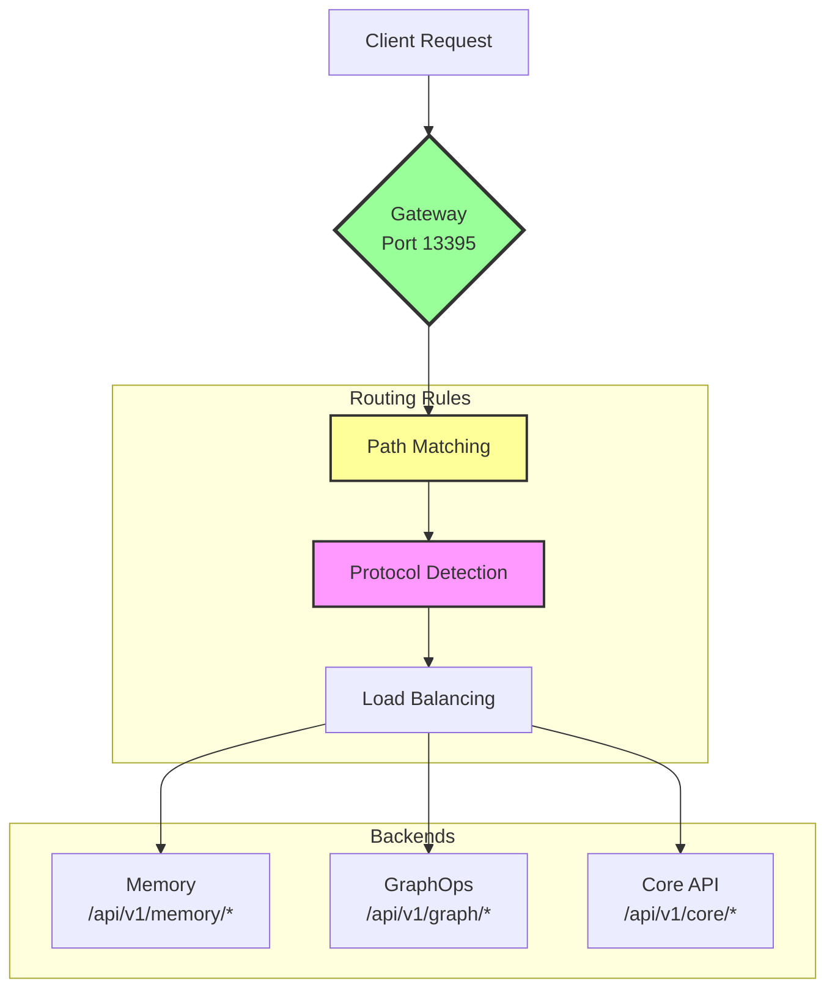
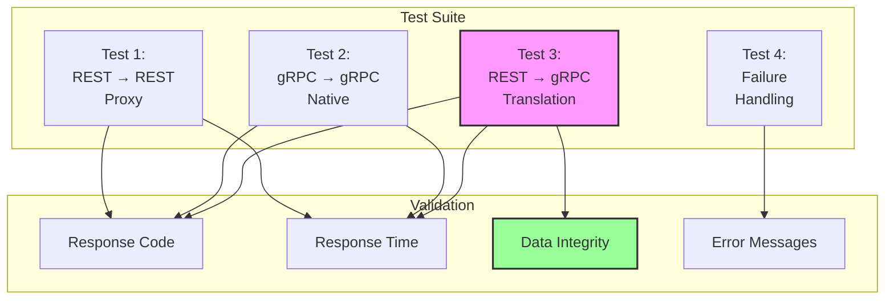
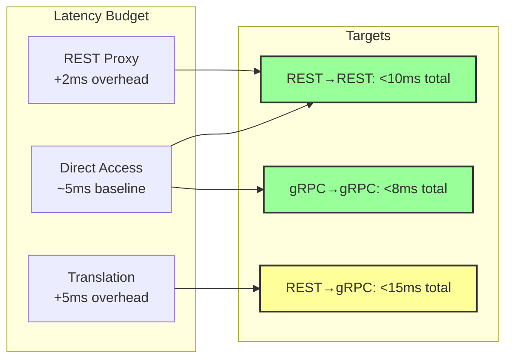

# SPEC-132: Architecture Diagrams

Visual representations of gateway protocol architecture options.

---

## 🔍 CURRENT STATE



**Problem:** Gateway cannot route to REST backends, clients must access directly.

---

## 🎯 OPTION 1: gRPC-Only Gateway (Current)



**Pros:** Simple, focused
**Cons:** No unified endpoint

---

## 🔄 OPTION 2: Hybrid Gateway (RECOMMENDED)



**Pros:** Unified endpoint, gradual migration
**Cons:** Translation overhead (minimal)

---

## 🔀 OPTION 3: Dual Gateway Pattern



**Pros:** Protocol-specific optimizations
**Cons:** Two services to maintain

---

## 🌐 OPTION 4: Envoy Proxy



**Pros:** Enterprise features, protocol agnostic
**Cons:** Complex configuration, overkill for current scale

---

## 📊 PROTOCOL FLOW: Hybrid Gateway (Recommended)



---

## 🏗️ MIGRATION PATH

```mermaid
graph LR
    subgraph "Phase 1: Today"
        P1Gateway[Gateway<br/>gRPC-only]
        P1GraphOps[GraphOps<br/>gRPC ✅]
        P1Memory[Memory<br/>REST]
        P1Core[Core API<br/>REST]

        P1Gateway --> P1GraphOps
        P1Gateway -.x P1Memory
        P1Gateway -.x P1Core
    end

    subgraph "Phase 2: Hybrid"
        P2Gateway[Gateway<br/>Hybrid ✅]
        P2GraphOps[GraphOps<br/>gRPC ✅]
        P2Memory[Memory<br/>REST → gRPC]
        P2Core[Core API<br/>REST]

        P2Gateway --> P2GraphOps
        P2Gateway --> P2Memory
        P2Gateway --> P2Core
    end

    subgraph "Phase 3: Future"
        P3Gateway[Gateway<br/>gRPC-primary]
        P3GraphOps[GraphOps<br/>gRPC ✅]
        P3Memory[Memory<br/>gRPC ✅]
        P3Core[Core API<br/>REST]

        P3Gateway --> P3GraphOps
        P3Gateway --> P3Memory
        P3Gateway --> P3Core
    end

    P1Gateway ==> P2Gateway
    P2Gateway ==> P3Gateway

    style P1Gateway fill:#ff9,stroke:#333,stroke-width:2px
    style P2Gateway fill:#9f9,stroke:#333,stroke-width:3px
    style P3Gateway fill:#9cf,stroke:#333,stroke-width:2px
```

**Legend:**
- **Phase 1:** Current state (gRPC-only, incomplete)
- **Phase 2:** Hybrid gateway (REST proxy + gRPC native)
- **Phase 3:** Full gRPC with REST legacy support

---

## 🔧 ROUTING ARCHITECTURE



---

## 🧪 TESTING FLOW



---

## 📈 PERFORMANCE EXPECTATIONS



---

**These diagrams support SPEC-132 decision-making process.**

**Generated:** October 22, 2025
**Format:** Mermaid (GitHub/GitLab compatible)
