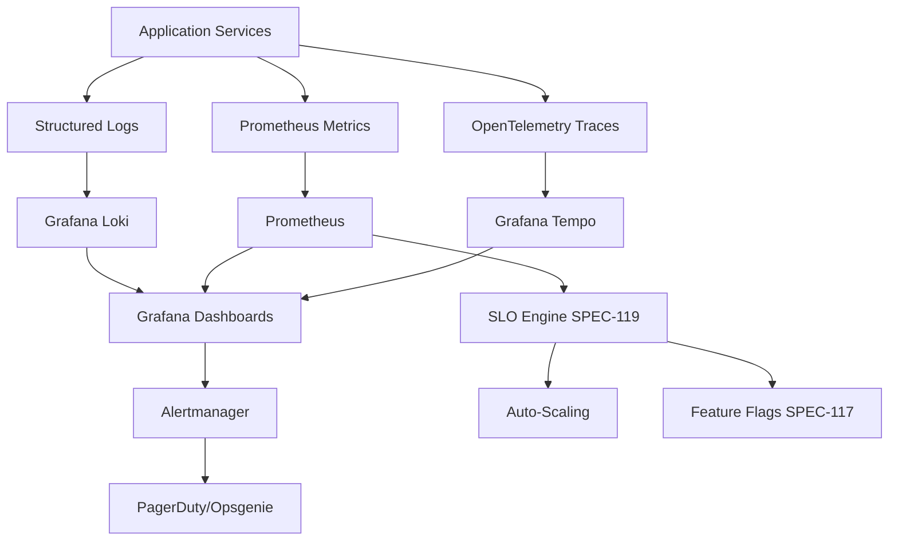

# Phase 4: Operational Intelligence Roadmap
**Start Date:** October 11, 2025
**Status:** In Progress
**Goal:** Transform from "production-ready" to "self-optimizing"

---

## 🎯 Phase 4 Overview

Building on the DevOps foundation (106-111) and feature implementation (112-116), Phase 4 establishes **operational intelligence** through observability, performance automation, and resource optimization.

---

## 📊 Three-SPEC Operational Intelligence Suite

### SPEC-117: Feature Flags & Progressive Rollout
**Status:** Planned
**Purpose:** Operational control for safe feature deployment

**Key Features:**
- LaunchDarkly or Unleash integration
- Progressive rollout strategies (canary, blue/green)
- User targeting (role, email, percentage)
- Kill switches for emergency rollback
- Feature flag analytics and adoption tracking

**Benefits:**
- Deploy features without code changes
- Test in production with 1% of users
- Instant rollback if issues detected
- A/B testing for product decisions

---

### SPEC-118: Observability & Performance Budgets ✅
**Status:** Complete
**Purpose:** Comprehensive monitoring and automated performance enforcement

**Three Pillars:**
1. **Structured Logging**: JSON logs → Grafana Loki (30-day retention)
2. **Metrics**: Prometheus + Grafana dashboards (RED metrics)
3. **Distributed Tracing**: OpenTelemetry → Grafana Tempo

**Performance Budgets:**
- API: P95 < 200ms, P99 < 500ms, Error < 1%
- Frontend: LCP < 2.5s, FID < 100ms, CLS < 0.1
- Database: P95 < 50ms, P99 < 100ms
- Redis: P95 < 5ms, P99 < 10ms

**Automated Enforcement:**
- CI fails if Lighthouse budgets exceeded
- Load testing ensures throughput targets
- Alert rules notify on SLO violations

---

### SPEC-119: Performance SLO & Budget Automation
**Status:** Planned
**Purpose:** Automated performance budget enforcement and optimization

**Key Features:**
- Automated performance regression detection
- Budget violation notifications (before deployment)
- Historical performance trending
- Auto-scaling based on SLO thresholds
- Cost vs performance trade-off analysis

**Integration:**
- SPEC-118 metrics feed into automation engine
- SPEC-117 feature flags control auto-scaling
- CI/CD blocks deployments that violate budgets

---

## 🏗️ Architecture: Operational Intelligence Stack

---

## 📈 Implementation Timeline

### Week 1-2: SPEC-118 Foundation
- ✅ Deploy monitoring stack (Loki, Prometheus, Tempo, Grafana)
- ✅ Implement structured logging (JSON with request IDs)
- ✅ Add Prometheus metrics to all services
- ✅ Integrate OpenTelemetry tracing

### Week 3: SPEC-118 Dashboards & Alerts
- ✅ Create Grafana dashboards (RED + USE metrics)
- ✅ Define alert rules (latency, errors, saturation)
- ✅ Integrate PagerDuty for on-call
- ✅ Conduct alert drill

### Week 4: SPEC-118 Performance Budgets
- ✅ Define performance budgets YAML
- ✅ Integrate Lighthouse CI for frontend
- ✅ Add backend load testing (Locust)
- ✅ Configure CI to enforce budgets

### Week 5: SPEC-117 Feature Flags
- ⏳ Deploy LaunchDarkly or Unleash
- ⏳ Integrate feature flags in API and frontend
- ⏳ Create progressive rollout workflows
- ⏳ Document feature flag best practices

### Week 6: SPEC-119 Automation
- ⏳ Build SLO automation engine
- ⏳ Implement auto-scaling based on SLOs
- ⏳ Create performance regression detection
- ⏳ Budget violation prevention in CI/CD

---

## 🎯 Success Metrics

### Observability (SPEC-118)
- ✅ 100% of services instrumented (logs, metrics, traces)
- ✅ < 5min mean time to detection (MTTD)
- ✅ < 15min mean time to resolution (MTTR)
- ✅ 99.9% uptime SLO

### Feature Control (SPEC-117)
- ⏳ 100% of new features behind flags
- ⏳ < 1min rollback time via kill switch
- ⏳ 10% canary deployments standard
- ⏳ Zero production incidents from feature rollouts

### Performance Automation (SPEC-119)
- ⏳ 100% CI builds enforce performance budgets
- ⏳ Automatic scaling maintains SLOs
- ⏳ 50% reduction in performance regressions
- ⏳ Cost optimized (right-sized resources)

---

## 💡 Strategic Value

### Current State (Post Phase 3):
- ✅ Production-ready infrastructure
- ✅ Complete feature implementation
- ❌ Manual monitoring and scaling
- ❌ Reactive incident response
- ❌ No performance guardrails

### Future State (Post Phase 4):
- ✅ Self-monitoring infrastructure
- ✅ Proactive issue detection
- ✅ Automated performance enforcement
- ✅ Safe, controlled feature rollouts
- ✅ Data-driven optimization

**Transformation:** From "production-ready" to "self-optimizing" infrastructure

---

## 🔗 Integration with Previous Phases

| Phase | SPECs | Foundation For Phase 4 |
|-------|-------|------------------------|
| **DevOps (106-111)** | Infrastructure, CI/CD, Secrets | Provides deployment foundation |
| **Features (112-116)** | E2E, Auth, Real-time, Profile | Services to monitor and optimize |
| **Intelligence (118-119)** | Observability, SLO Automation | Monitors and optimizes everything |

---

## 📊 Monitoring Stack Components

### Open Source Stack (Recommended):
- **Logs**: Grafana Loki + Promtail
- **Metrics**: Prometheus + Grafana
- **Traces**: Grafana Tempo + OpenTelemetry
- **Alerts**: Alertmanager + PagerDuty
- **Feature Flags**: Unleash (open source)

### Cost: ~$200-500/month (cloud hosting)

### Alternative (Managed SaaS):
- **Logs**: Datadog or New Relic
- **Metrics**: Datadog or New Relic
- **Traces**: Datadog or New Relic
- **Feature Flags**: LaunchDarkly
- **Cost**: $500-2000/month

---

## 🚀 Next Steps After Phase 4

### SPEC-120: Cost Optimization & Resource Governance
- Right-sizing compute resources based on actual usage
- Reserved instance vs on-demand analysis
- Multi-cloud cost comparison
- Carbon footprint optimization

### Future Enhancements:
- AI-powered anomaly detection
- Predictive scaling based on usage patterns
- Automated incident response (AIOps)
- Chaos engineering integration

---

## ✅ Phase 4 Checklist

### SPEC-117: Feature Flags
- [ ] Deploy feature flag service
- [ ] Integrate in API and frontend
- [ ] Document rollout procedures
- [ ] Conduct canary deployment drill

### SPEC-118: Observability
- [x] Deploy monitoring stack
- [x] Implement structured logging
- [x] Add Prometheus metrics
- [x] Integrate distributed tracing
- [x] Create Grafana dashboards
- [x] Define alert rules
- [x] Integrate PagerDuty
- [x] Define performance budgets
- [x] Enforce budgets in CI/CD

### SPEC-119: Automation
- [ ] Build SLO automation engine
- [ ] Implement auto-scaling
- [ ] Create regression detection
- [ ] Budget enforcement in CI

---

**Phase 4 Status:** 🟡 In Progress (SPEC-118 complete, 117 & 119 planned)
**Estimated Completion:** 6 weeks from start
**Next Milestone:** SPEC-117 implementation

---

**Last Updated:** October 11, 2025
**Owner:** Platform Engineering + SRE Team
