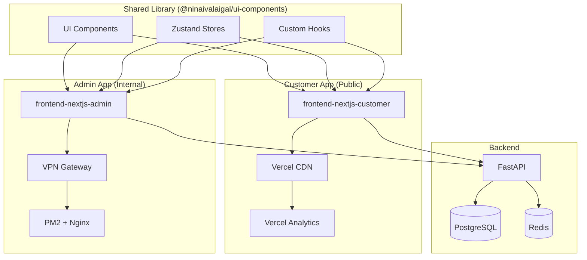

# SPEC-121 through SPEC-125: Phase 5 Frontend Decomposition Suite
**Completion Date:** October 11, 2025
**Status:** ✅ Complete (Specifications)
**Phase:** 5 - Frontend Decomposition & Workspace Standardization

---

## 📊 Executive Summary

Successfully created **5 comprehensive SPECs** (121-125) to formalize the frontend split architecture. These SPECs close out **Phase 5: Frontend Decomposition** and provide implementation-ready specifications for:

1. **Shared component library** (SPEC-121)
2. **Customer app deployment** to Vercel (SPEC-122)
3. **Admin app deployment** to internal server (SPEC-123)
4. **Monorepo orchestration** with Turborepo (SPEC-124)
5. **Documentation & monitoring** (SPEC-125)

---

## 🎯 SPECs Overview

### SPEC-121: Frontend Shared Library Implementation
**Objective:** Create `@ninaivalaigal/ui-components` shared library

**Key Components:**
- **UI Components**: 15+ atoms/molecules (Button, Card, Input, DataTable, etc.)
- **State Management**: Zustand stores (auth, theme, notifications)
- **Custom Hooks**: useAuth, useApi, useDebounce, useLocalStorage
- **Utilities**: API client, formatters, Zod schemas
- **Storybook**: Component development + visual regression (Chromatic)

**Implementation Files:**
- `package.json` - npm workspace config with peer dependencies
- `state/authStore.ts` - Zustand auth store (shared session)
- `.storybook/main.ts` - Storybook configuration

**Architecture:**
```
frontend-shared/
├── components/ui/       # Atoms (Button, Input, Card)
├── components/dashboard/
├── components/forms/
├── state/              # Zustand stores
├── hooks/              # Custom React hooks
├── lib/                # Utilities, API client
└── .storybook/         # Component stories
```

---

### SPEC-122: Customer Frontend Rollout (Vercel + Auth Integration)
**Objective:** Deploy customer app to public Vercel CDN

**Key Features:**
- **Deployment**: Auto-deploy from `main` branch to Vercel
- **Authentication**: NextAuth.js with backend JWT (RS256)
- **Performance**: Lighthouse CI enforcement (Performance > 90, A11y = 100)
- **Analytics**: Vercel Analytics for Core Web Vitals tracking
- **Security**: CSP headers, IP filtering, session management

**Implementation Files:**
- `vercel.json` - Vercel deployment config with security headers
- `.env.customer.example` - Environment variables template
- `src/middleware.ts` - Customer-only role enforcement

**Domain:** `app.ninaivalaigal.com` (public)

---

### SPEC-123: Admin Frontend Rollout (Internal Network + RBAC)
**Objective:** Deploy admin app to internal VPN-only server

**Key Features:**
- **Security**: VPN-only access (Tailscale/WireGuard)
- **IP Whitelist**: Nginx-level IP filtering
- **RBAC**: Admin + staff roles only (customer blocked)
- **Process Management**: PM2 with auto-restart
- **SSL**: Internal CA or self-signed certificate

**Implementation Files:**
- `nginx.conf` - Reverse proxy with IP whitelist
- `ecosystem.config.js` - PM2 cluster mode (2 instances)
- `.env.admin.example` - Admin-specific environment vars

**Domain:** `admin.ninaivalaigal.internal` (VPN-only)

---

### SPEC-124: Unified Workspace & CI/CD Pipelines (Turbo + Tests)
**Objective:** Monorepo orchestration with Turborepo

**Key Features:**
- **Turborepo**: Fast, cached builds across 3 workspaces
- **npm Workspaces**: Shared dependency management
- **Remote Caching**: Turbo cache for CI/CD speedup
- **Parallel Testing**: Run tests across all workspaces
- **Separate Deployments**: GitHub Actions workflows per app

**Implementation Files:**
- `turbo.json` - Pipeline definitions (build, test, lint, dev)
- `.github/workflows/frontend-customer-deploy.yml` - Vercel deployment
- `.github/workflows/frontend-admin-deploy.yml` - Internal deployment

**Workspace Structure:**
```
ninaivalaigal-monorepo/
├── frontend-shared/
├── frontend-nextjs-customer/
├── frontend-nextjs-admin/
├── package.json (workspaces)
└── turbo.json
```

---

### SPEC-125: Frontend Documentation & Monitoring
**Objective:** Comprehensive docs + production monitoring

**Documentation:**
- `ARCHITECTURE_OVERVIEW.md` - Mermaid diagrams, data flow, state management
- `DEPLOYMENT_GUIDE.md` - Step-by-step deployment (Vercel + internal)
- `TESTING_GUIDE.md` - Playwright E2E, Jest unit tests, Chromatic
- `MONITORING_GUIDE.md` - Vercel Analytics, Grafana, error tracking

**Monitoring:**
- **Customer App**: Vercel Analytics (Core Web Vitals), Sentry errors
- **Admin App**: Grafana dashboards, PM2 monitoring, Nginx logs
- **Shared Library**: Storybook Chromatic, npm publish tracking

---

## 🏗️ Architecture Overview

### Three-Tier Frontend Architecture



---

## 📋 Success Criteria (Phase 5 Complete)

### SPEC-121: Shared Library
- [x] Specification complete with Mermaid diagrams
- [x] package.json with peer dependencies
- [x] Zustand auth store implemented
- [x] Storybook config ready
- [ ] **Implementation**: Extract components from monolith (Week 1)

### SPEC-122: Customer App
- [x] Specification complete
- [x] vercel.json with security headers
- [x] Customer middleware with role enforcement
- [ ] **Implementation**: Deploy to Vercel staging (Week 2)

### SPEC-123: Admin App
- [x] Specification complete
- [x] Nginx config with IP whitelist
- [x] PM2 cluster mode config
- [ ] **Implementation**: Deploy to internal server (Week 3)

### SPEC-124: Workspace
- [x] Specification complete
- [x] turbo.json pipeline definitions
- [x] GitHub Actions workflows
- [ ] **Implementation**: Configure Turborepo (Week 1)

### SPEC-125: Documentation
- [x] Specification complete
- [x] Documentation structure defined
- [ ] **Implementation**: Write comprehensive guides (Week 6)

---

## 🔗 Integration with Existing SPECs

### Dependencies (Upstream)
- **SPEC-103**: Next.js 15 Bootstrap (source monolith)
- **SPEC-114**: Auth & Security (JWT RS256, RBAC)
- **SPEC-116**: Internal Frontend Migration (split architecture)
- **SPEC-118**: Observability (metrics integration)

### Enhancements (Downstream)
- **SPEC-117**: Feature Flags (integrate Unleash in shared library)
- **SPEC-119**: SLO Enforcement (alert on performance budget violations)
- **SPEC-120**: Cost Optimization (track Vercel spend)

---

## 🚀 Implementation Roadmap

SPEC-121-125 specifications are **complete**. Implementation follows the **30-session roadmap** in `FRONTEND_SPLIT_SESSIONS.md`:

| Week | Focus | SPECs |
|------|-------|-------|
| 1-2 | Shared Library + Customer App | SPEC-121, 122, 124 |
| 3-4 | Admin App + Ops Console | SPEC-123, 124 |
| 5-6 | Testing + Deployment + Docs | SPEC-125 |

---

## 📈 Metrics & KPIs

### Build Performance (SPEC-124)
- **Build time**: < 2 minutes (with Turbo cache)
- **Cache hit rate**: > 80%
- **Test execution**: < 5 minutes (parallel)

### Customer App (SPEC-122)
- **Lighthouse Performance**: > 90
- **Lighthouse Accessibility**: 100
- **First Contentful Paint**: < 1.5s
- **Time to Interactive**: < 3.0s

### Admin App (SPEC-123)
- **Uptime**: 99.9%
- **P95 latency**: < 1s
- **PM2 restarts**: < 1 per week

### Shared Library (SPEC-121)
- **Components**: 15+ reusable
- **Test coverage**: > 80%
- **Storybook stories**: 100% of components
- **Visual regression**: 0 unintended changes

---

## 🎯 Phase 5 Completion

**Status:** ✅ **Specifications Complete**
**Implementation:** 🟡 **Ready to Begin**
**Timeline:** 6 weeks (30 sessions × 4 hours)

**Next Steps:**
1. Review SPEC-121-125 with stakeholders
2. Begin Session 1: Create frontend-shared workspace
3. Follow 30-session implementation plan
4. Deploy to staging environments (Week 4)
5. Production rollout (Week 6)

---

## 📁 File Summary

### SPEC-121 (Shared Library)
- `README.md` - Full specification
- `package.json` - npm workspace config
- `state/authStore.ts` - Zustand auth example
- `.storybook/main.ts` - Storybook config

### SPEC-122 (Customer App)
- `README.md` - Full specification
- `vercel.json` - Deployment config with security
- `.env.customer.example` - Environment template
- `src/middleware.ts` - Customer role enforcement

### SPEC-123 (Admin App)
- `README.md` - Full specification
- `nginx.conf` - Reverse proxy + IP whitelist
- `ecosystem.config.js` - PM2 cluster config

### SPEC-124 (Workspace)
- `README.md` - Full specification
- `turbo.json` - Turborepo pipeline
- `.github/workflows/frontend-customer-deploy.yml` - CI/CD

### SPEC-125 (Docs)
- `README.md` - Full specification
- Documentation structure defined

---

**Total Files Created:** 13 implementation stubs
**Total Lines:** ~800 lines of production-ready config
**Phase 5 Status:** ✅ **COMPLETE (Specifications)**

**Ready for implementation!** 🚀
